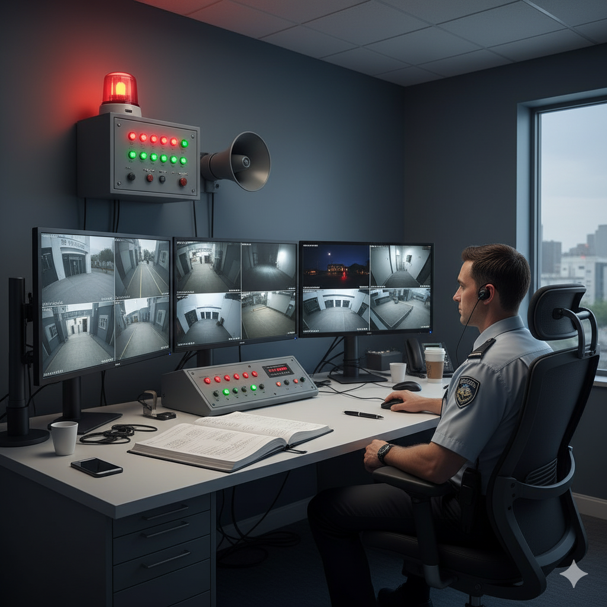

<!-- _class: title-slide -->
## ISC2 Certified in Cybersecurity
# Domain 3:  Access Controls Concepts
This Slide is a part of Cyber Security for All Project
[https://github.com/CS4A/]

---
# Exam Objectives
3.1 - Understand physical access controls
* Physical security controls (e.g., badge systems, gate entry, environmental design)
* Monitoring (e.g., security guards, closed-circuit television (CCTV), alarm systems, logs)
* Authorized versus unauthorized personnel

3.2 - Understand logical access controls
* Principle of least privilege
* Segregation of duties
* Discretionary access control (DAC)
* Mandatory access control (MAC)
* Role-based access control (RBAC)

### 
Exam Weight 22%

---
<!-- _class: title-slide -->
## Part 1
# Foundational Access Control Concepts

---
# Access Control Concept

* **Subject** - The active entity that requests access to a resource (e.g., a user, a program, a process).
* **Object** - The passive entity or resource to be accessed (e.g., files, databases, devices, a room).
* **Rule / Access** - The action the subject is allowed to perform on the object (e.g., Read, Write, Delete, Enter).
 

---

# IAAA / AAA Process

| Step | Action | Description |
| :--- | :--- | :--- |
| **I** | **Identification** | Who are you? (Claiming an identity, e.g., username) |
| **A** | **Authentication** | Prove it. (Verifying the identity, e.g., password, MFA) |
| **A** | **Authorization** | What can you do? (Determining permissions) |
| **A** | **Accountability** | What did you do? (Logging and tracking actions) |
---
# Authorized & Unauthorized Personnel
* **Authorized Personnel:** Individuals who have been explicitly granted permission to access a specific resource.
* **Unauthorized Personnel:** Anyone who lacks the explicit permission to access that resource.

> The primary goal of access control is to ensure only authorized subjects can access objects.

---
# Types of Controls

1.  **Administrative Controls:** The "rules" and "paperwork." These are management-oriented controls like **policies, procedures, and training**. They direct people's behavior. (e.g., a password policy document).
2.  **Technical Controls** (Logical Controls): The "technology." Hardware or software mechanisms that enforce the rules, such as **firewalls, encryption, and authentication systems**.
3.  **Physical Controls:** The "real world." Tangible controls that protect physical spaces and assets, like **locks, fences, guards, and cameras**.
---
# Categories of Security Control (Functionality)

* **Preventive:** Stops an incident before it happens. (*e.g., A locked door, a firewall rule*)
* **Detective:** Identifies an incident during or after it occurs. (*e.g., A security camera, an intrusion detection system*)
* **Corrective:** Fixes a problem after an incident. (*e.g., Antivirus removing a virus, restoring a backup*)
* **Recovery:** Returns systems to normal operations. (*e.g., Restoring from a full disaster recovery site*)

* **Deterrent:** Discourages an attacker. (*e.g., A "Guard Dog on Duty" sign, visible cameras*)
* **Directive:** Mandates or guides behavior. (*e.g., A policy document, an exit sign*)
* **Compensating:** An alternative control used when the primary one isn't feasible. (*e.g., Reviewing logs daily when real-time monitoring isn't possible*)

---

# Defense-in-Depth

* **Strategy:** Deploying **multiple, layered security controls** so that if one fails, another is there to stop the attack. This is also called a "layered defense."
* **Goal:** To ensure there is no single point of failure.
* **Result:** It significantly increases the **Work Factor** for an attacker—the time and effort required to bypass security.

---
<!-- _class: title-slide -->
## Part 2
# Physical Access Controls
---
# Crime Prevention Through Environmental Design (CPTED)

**CPTED** (pronounced *sep-ted*) is a design philosophy that uses the physical environment to positively influence human behavior and reduce the fear and incidence of crime. It's about making a space feel and be naturally safe.

### Three Core Principles:
1.  **Natural Surveillance ("See and Be Seen"):**
    * **Goal:** Maximize visibility so legitimate users can observe the space, making potential offenders feel watched.
    * **Examples:** Using low landscaping, adding lighting to pathways, and placing windows overlooking parking lots.

---
# Crime Prevention Through Environmental Design (CPTED)

2.  **Natural Access Control ("Guide the Flow"):**
    * **Goal:** Use buildings, fences, and landscaping to guide people to and from proper entrances.
    * **Examples:** A single, clearly marked entrance to a building; walkways that lead people away from sensitive areas.

3.  **Natural Territorial Reinforcement ("This is Our Space"):**
    * **Goal:** Create a clear sense of ownership and define the boundary between public and private space.
    * **Examples:** Low fences, decorative paving, or signs like "Employees Only Beyond This Point."

---
# CPTED in Action: Real-World Scenarios

Let's see how these principles apply in practice.

| Scenario | CPTED Principle Applied | How it Works |
| :--- | :--- | :--- |
| **Problem:** Employees feel unsafe walking to their cars in a dimly lit parking garage at night. | **Natural Surveillance** | Adding bright, uniform lighting eliminates dark corners where an attacker could hide. Placing a security guard booth with large windows overlooking the area increases the feeling of being watched. |
| **Problem:** Unauthorized people are cutting through a private courtyard to get to the next street. | **Natural Access Control** & **Territorial Reinforcement** | Planting a thorny hedge or installing a decorative (but sturdy) fence clearly defines the path and makes the shortcut difficult. This reinforces that the courtyard is private property. |

---
# CPTED in Action: Real-World Scenarios (Cont'd)

| Scenario | CPTED Principle Applied | How it Works |
| :--- | :--- | :--- |
| **Problem:** A company wants to protect its loading dock from unauthorized vehicle access. | **Natural Access Control** | Installing **bollards** or large, heavy planters allows people to walk by but physically blocks cars and trucks from approaching the doors, guiding vehicle traffic to the proper gate. |
---

# Layer 1: The Perimeter
Perimeter defenses are the first line of physical defense.

* **Fences & Walls:** Used to create a clear boundary (Territorial Reinforcement) and channel people to gates (Access Control).
    * A 1-meter fence is mostly a **deterrent**.
    * A 2.4-meter fence with barbed wire is **preventive**.
* **Gates:** Controlled entry points in the fence line.
* **Bollards:** Short, sturdy posts used to prevent vehicles from ramming into a building while allowing pedestrian traffic. Planters or other heavy decorative objects can serve the same purpose.

---
# Layer 2: The Facility
Once past the perimeter, an attacker must breach the facility itself.

* **Locks:** A fundamental **preventive** control.
    * **Keyed Locks:** Vulnerable to picking, bumping, and unauthorized key duplication.
    * **Combination Locks:** Less secure; vulnerable to shoulder surfing.
    * **Biometric Locks:** Uses a physical characteristic (e.g., fingerprint). A fingerprint scanner on a server room door is a **physical control**.
    * **Smart Locks:** Offer keyless entry and remote management, excellent for emergency access.
* **Doors & Windows:** Must be hardened against forced entry.
 

 &nbsp;&nbsp;&nbsp;  &nbsp;&nbsp;&nbsp; 

---
# Entrance Barriers & Flow Control
These controls are designed to prevent unauthorized entry, specifically by defeating tailgating and piggybacking.

* **Turnstiles & Revolving Doors:** Allow only **one person through at a time**, making it difficult for someone to follow an authorized user.

 

---
# Entrance Barriers: Mantraps / Security Vestibules

These controls are designed for high-security areas to enforce single-person entry and prevent tailgating.

* **Mantrap (a.k.a. Security Vestibule):** An interlocking door system where a person enters through the first door, which must close and lock behind them before the second door will open.
    * **Purpose:** To isolate an individual for a secondary authentication check (e.g., biometrics, guard verification).
    * **Benefit:** Physically prevents an unauthorized person from following an authorized one.
    * **Advanced Features:** May include weight sensors to detect if more than one person is inside. 

> The term **Security Vestibule** is often preferred in corporate environments as it sounds less aggressive than "Mantrap." Both terms refer to the same control.

> The term **Security Vestibule** is often preferred in corporate environments as it sounds less aggressive than "Mantrap." Both terms refer to the same control.

---
# Tailgating vs. Piggybacking

A key distinction for the exam:

* **Tailgating:** An unauthorized person follows an authorized person through a secure entrance **without their consent**. They just slip in right behind them.
* **Piggybacking (or Social Engineering):** An unauthorized person tricks an authorized person into letting them in. For example, "Hey, can you hold the door for me? I forgot my badge."

> Mantraps and turnstiles are effective technical controls against both. Security awareness training is an effective administrative control against piggybacking.

 &nbsp;&nbsp;&nbsp;&nbsp;&nbsp;&nbsp;&nbsp;&nbsp;&nbsp;&nbsp;&nbsp;&nbsp;&nbsp;&nbsp;&nbsp;&nbsp;&nbsp;&nbsp;&nbsp;&nbsp;&nbsp;&nbsp;&nbsp; 

---
# Human Safety: Fail-Safe vs. Fail-Secure

When a system fails (like a power outage), how should it behave?

* **Fail-Safe (Fail-Open):** The system fails in a way that prioritizes **life safety**. The door **unlocks and opens** to allow people to escape. This is required for emergency exits.
* **Fail-Secure (Fail-Closed):** The system fails in a way that prioritizes **security**. The door **locks and remains closed** to protect the assets inside.

> **Human life is always more important than the asset.** Therefore, any door on an escape route MUST be configured to be fail-safe.
---
# Layer 3: Personnel & Monitoring
Controls related to identifying and managing people within the facility.

* **Security Guards:** A flexible control that is **deterrent, preventive, and detective**. They can check IDs, monitor cameras, and respond to incidents.
* **Badge Systems:** Used to identify authorized personnel.
    * **Magnetic Stripe:** Older, less secure, easy to clone.
    * **Smart Cards:** Contain a microchip, much more secure, and can be used for both physical and logical access.
* **Visitor Management:**
    * Visitors must sign a log.
    * They should wear clearly identifiable visitor badges.
    * They must be **escorted** by an employee in secure areas.

---
# Physical Monitoring & Auditing

* **Closed-Circuit Television (CCTV):**
    * **Detective Control:** Records events for investigation.
    * **Deterrent Control:** Visible cameras can discourage attackers.
* **Alarm Systems:** Use sensors (motion, door/window contacts) to detect intrusions and trigger an alert. This is a **detective** control.
* **Physical Access Logs:**
    * Records of who entered/exited a facility (e.g., visitor sign-in sheets, badge reader logs).
    * This is a **detective** control used for **accountability** and forensic investigation after an incident.

---
# Layer 4: Asset Protection
Protecting the critical infrastructure and data within the facility.

* **Environmental Controls:**
    * **HVAC (Heating, Ventilation, Air Conditioning):** Maintains proper temperature and humidity to prevent server damage.
    * **Fire Suppression:** Gas-based systems (e.g., clean agents) are preferred for server rooms because they extinguish fires without damaging electronics like water would.
* **Power:** Uninterruptible Power Supplies (UPS) and backup generators provide power redundancy to prevent outages.
* **Secure Destruction of Media:** When physical media (hard drives, tapes, paper) is no longer needed, it must be destroyed securely.
    * **Shredding, Pulverizing:** Physical destruction.
    * **Degaussing:** Using a powerful magnet to destroy data on magnetic tapes. This is often the most effective method for tapes.
    * **Overwriting/Data Wiping:** Overwriting data multiple times with random patterns to render it 
---
<!-- _class: title-slide -->
## Part 3
# Logical Access Controls 

---
# Deep Dive: Identification & Authentication

* **Identification:** The user *claims* an identity (e.g., entering a username).
* **Authentication:** The user *proves* their identity. This is where we verify the claim.

### Authentication Factors - "Prove it!"
Authentication relies on proving you have one or more of these:

1.  **Something You Know:** A password, PIN, or secret question.
2.  **Something You Have:** A smart card, mobile phone (for push notifications), or hardware token.
3.  **Something You Are:** A biometric characteristic like a fingerprint, face scan, or iris scan.
---
# Managing Memorized Secrets: Password Policies

Password policies are **administrative controls** that define the rules for creating and handling passwords ("something you know") to strengthen authentication.

### Key Components of a Strong Password Policy:
* **Length:** Specifies a **minimum number of characters**. This is the single most important factor in password strength. Longer is always better.
* **Complexity:** Requires a mix of character types (e.g., uppercase, lowercase, numbers, special symbols `!@#$%`). This makes passwords harder to guess.
* **History:** Prevents users from reusing their last `X` number of passwords, forcing them to create a new, unique one.
* **Expiration:** Sets a maximum age for a password, requiring users to change it periodically (e.g., every 90 days).

> **Important Note:** How the system **stores** passwords (e.g., using hashing and salting) is a critical **technical control**, but the requirements for users are defined in the administrative policy.

---
# Single-Factor vs. Multi-Factor Authentication (MFA)

* **Single-Factor Authentication (SFA):** Uses only **one** factor (e.g., just a password). This is weak.
* **Multi-Factor Authentication (MFA):** Uses **two or more *different*** factors. This is strong.
    * *Example:* Password (**know**) + Push notification on your phone (**have**).
    * *Non-Example:* A password and a PIN. Both are "something you know," so this is **not** MFA. It's single-factor, multi-step authentication.

> MFA dramatically increases security by raising the **Work Factor**—the effort required for an attacker to compromise an account.
---
# Deep Dive: Authorization & Accountability

* **Authorization:** Happens *after* successful authentication. The system determines what the verified user is **allowed to do**. This is where we enforce permissions.

* **Accountability:** The ability to trace an action back to a specific subject.
    * This is achieved through **logging and auditing**.
    * Accountability supports **non-repudiation**, which means a user cannot deny having performed an action.
    * **Shared accounts are the enemy of accountability.** If 10 people use the `admin` account, you can't prove who did what.
---

# The Goal of Accountability: Non-Repudiation

Strong accountability provides us with one of the most important security guarantees: **non-repudiation**.

### What is Non-Repudiation?
Non-repudiation is the assurance that a subject cannot deny having performed an action. It provides undeniable proof of an action's origin and integrity.

### How We Achieve Non-Repudiation
We use specific technical mechanisms to create a strong, verifiable evidence trail:

* **Digital Signatures:** This is the strongest method. It uses public-key cryptography to bind a user's identity to a specific transaction or document, ensuring both authenticity and integrity.
* **Audit Logs:** Detailed, time-stamped logs provide a comprehensive record of user activities (e.g., who logged in, what files they accessed, and when).
* **Biometrics:** Using a unique physical characteristic can provide strong evidence that a specific person was physically present to authorize an action.

---
# Core Principle: Least Privilege (PoLP)

* **Definition:** Granting a subject only the **minimum level of access and permissions** necessary to perform their job functions. No more, no less.
* **Goal:** To minimize the potential damage ("blast radius") from a compromised account or an insider threat.
* **Related Concept: Need to Know:** This is the justification for access. You only get access to data if you have a legitimate business "need to know" it to do your job.

> **Least Privilege** is about the permissions you have (the *what*), while **Need to Know** is about the data you can access (the *why*).
---
# Core Principle: Segregation of Duties (SoD)

* **Definition:** A **preventive** control that divides a critical or sensitive task into parts that must be performed by **multiple individuals**.
* **Goal:** To prevent a single person from having enough power to commit fraud or cause a major error, either maliciously or accidentally.
* **Example (Maker-Checker):** The person who *submits* an expense report (the Maker) cannot be the same person who *approves* it (the Checker). This requires collusion between two people to commit fraud.
* **Two-Person Control:** A specific type of SoD where two people must be present and act concurrently to perform a task (e.g., two people with two separate keys to launch a missile).
---
# Core Principle: The Two-Person Rule

This is a specific implementation of Segregation of Duties (SoD) that requires the concurrent action of two authorized individuals to perform a critical task. The goal is to prevent unilateral action.

### Key Implementations:

1.  **Two-Person Control (Concurrency):**
    * **Definition:** Requires two individuals to take a joint action **at the same time** to complete a sensitive task. Neither person can complete the action alone.
    * **Analogy:** Launching a nuclear missile. It requires two different people to turn their keys simultaneously. 🔑🔑
    * **Cybersecurity Example:** Restoring a critical server from an encrypted backup might require one administrator with the decryption key and another with the server root password, both present at the same time.
---
# Core Principle: The Two-Person Rule
2.  **Two-Person Integrity (Maker-Checker):**
    * **Definition:** One person (the "Maker") creates or requests an action, and a second, independent person (the "Checker" or "Approver") must approve it before it can be executed.
    * **Analogy:** A junior analyst (Maker) prepares a major financial transfer, but a manager (Checker) must approve it before the bank processes it.
    * **Cybersecurity Example:** A system administrator requests a firewall rule change. The change is staged but only goes live after a security manager reviews and approves the request in the system.

---
# Access Management Lifecycle
Managing user accounts is a continuous process.

1.  **Provisioning:** Creating an account and assigning initial permissions. This **must** be done according to the **Principle of Least Privilege**.
2.  **Review / Auditing:** Periodically reviewing user access rights to ensure they are still appropriate for their job role. This is crucial for preventing **Privilege Creep**.
3.  **Revocation:** De-provisioning or disabling an account and revoking all access rights immediately when an employee leaves the company or changes roles.
---
# Managing Account Types

Not all accounts are created equal. Categorizing accounts and assigning permissions based on their purpose is a fundamental part of enforcing the **Principle of Least Privilege (PoLP)**.

| Account Type | Purpose & Examples | Key Security Consideration |
| :--- | :--- | :--- |
| **User Account** | Standard, day-to-day access for employees to perform their job functions (e.g., email, applications). | This should be the default account type for everyone. Permissions must be strictly limited to their specific role. |
| **Privileged Account** | For system administration (`Administrator`, `root`, `superuser`). Used to manage systems, install software, and change configurations. | **Highest Risk.** These accounts should not be used for daily tasks. Their use must be logged, monitored, and tightly controlled (via PAM). |
---
# Managing Account Types

| Account Type | Purpose & Examples | Key Security Consideration |
| :--- | :--- | :--- |
| **Service Account** | Used by an application or service to run processes and interact with the operating system (e.g., a database service). | **Non-interactive** (humans shouldn't use them to log in). Requires very strong, managed passwords. |
| **Shared / Generic** | A single account used by multiple people (e.g., `frontdesk`, `auditor`). | **Destroys accountability** and non-repudiation. This practice is highly discouraged and should be avoided whenever possible. |
| **Guest Account**| Temporary access for visitors with extremely limited rights. | Represents a significant vulnerability. It **must be disabled by default** and only enabled for a specific purpose and duration. |

---
# The Danger of Privilege Creep
* **Definition:** The gradual accumulation of access rights and permissions beyond what a user needs for their current role.
* **How it Happens:** An employee moves from Role A to Role B, and then to Role C. They are granted new permissions for each role, but their old permissions are never revoked.
* **The Result:** After a few years, the user has a dangerous level of excessive permissions, violating the Principle of Least Privilege.
* **The Solution:** Regular **account access reviews** and a strict **revocation** process during role changes.
---
# Access Control Models
These are the frameworks or strategies for how authorization rules are implemented.

* **Discretionary Access Control (DAC):** The **owner** of the resource decides who gets access.
* **Mandatory Access Control (MAC):** A **central authority** (the system/administrator) assigns security labels to everything, and access is granted based on strict rules.
* **Role-Based Access Control (RBAC):** Access is based on the user's **job role**.
* **Attribute-Based Access Control (ABAC):** Highly granular access based on a combination of **attributes** (user, resource, environment, etc.).
* **Rule-Based Access Control (RuBAC):** Access is based on a set of predefined rules (e.g., a firewall).
---
# Discretionary Access Control (DAC)
* **Who Decides?** The **data owner**. If you create a file, you control who can see it.
* **Key Characteristic:** It is flexible and decentralized, or "discretionary."
* **Common Example:** Standard file permissions on Windows or Linux. You can right-click a folder you own and grant access to your colleagues.
* **Weakness:** It's not very secure in a large organization. This flexibility often leads to users granting excessive permissions, which violates the Principle of Least Privilege.
---
# Mandatory Access Control (MAC)
* **Who Decides?** The **system**, based on rules set by a central authority.
* **Key Characteristic:** The **most restrictive and secure** model. Users and owners **cannot** change permissions.
* **Mechanism:**
    * Objects (files) are given a **classification label** (e.g., Top Secret, Secret, Confidential).
    * Subjects (users) are given a **clearance level**.
    * Access is granted only if the user's clearance is equal to or higher than the object's classification.
* **Common Example:** Used in military and high-security government environments. Security-Enhanced Linux (SELinux) is a real-world implementation.
---
# Role-Based Access Control (RBAC)
* **Who Decides?** An administrator who assigns users to **roles**.
* **Key Characteristic:** The **most common model used in businesses today**. It's manageable, scalable, and enforces least privilege effectively.
* **Mechanism:**
    1.  Permissions are assigned to a **Role** (e.g., the "Accountant" role gets read/write access to the financial system).
    2.  Users are assigned to one or more **Roles**.
* **Benefit:** Instead of managing permissions for hundreds of individual users, you manage permissions for a handful of roles. When a new accountant starts, you just assign them the "Accountant" role.
---
# Attribute-Based Access Control (ABAC)
* **Who Decides?** A policy engine that evaluates a set of **attributes** in real-time.
* **Key Characteristic:** The **most granular and flexible** model.
* **Mechanism:** Access decisions can be based on any combination of attributes:
    * **Subject:** User's role, clearance, department.
    * **Object:** Data sensitivity, file type, location.
    * **Action:** Read, Write, Delete.
    * **Environment:** Time of day, user's physical location, device security posture.
* **Example:** "Allow doctors (Subject) to READ (Action) patient medical records (Object) only during business hours (Environment) and only from a hospital-managed device (Environment)."
---
# Rule-Based Access Control (RuBAC)

* **Who Decides?** The **system**, based on a specific set of predefined rules or policies crafted by an administrator.
* **Key Characteristic:** Access decisions are based on a simple `IF-THEN` logic. The rules apply to all subjects and objects uniformly, regardless of ownership or role.
* **Mechanism:** When a subject attempts to access an object, the system checks its rule set. If a rule allows the action, access is granted. If no rule explicitly allows it, access is typically denied (implicit deny).
* **Common Example:** A network **firewall** is the quintessential example of RuBAC. It doesn't care about your job title (RBAC) or who created the data (DAC); it only cares if the traffic's source IP, destination port, and protocol match an "allow" rule.  Firewall rule]
---
# Identity and Access Management (IAM) Technologies
* **Single Sign-On (SSO):** Authenticate **once** to a central service, and then get access to multiple different applications without needing to log in again.
    * *Pro:* Convenience.
    * *Con:* If your SSO credentials are stolen, the attacker gets the "keys to the kingdom." This is why SSO **must** be protected with MFA.
* **Federated Identity Management (FIM):** A type of SSO that works **across different organizations**. You use your identity from one company (e.g., your Google account) to log in to a service from another company (e.g., a third-party application).
    * *Technologies:* SAML and OpenID Connect are protocols that make this work.
---
# Privileged Access Management (PAM)
* **Definition:** A sub-discipline of IAM focused specifically on securing, managing, and monitoring **privileged accounts** (e.g., Administrator, root).
* **Why is it needed?** Compromise of a privileged account is catastrophic. Attackers with admin rights can do anything.
* **Best Practice:** Administrators should use a standard, non-privileged account for daily tasks. They should only use the privileged account when absolutely necessary, a practice known as **privilege elevation**.
* **PAM Systems:** Act like a secure vault for privileged credentials, logging every action taken with them.

---
# Logical Controls: Auditing & Monitoring

Setting up controls isn't enough; we must continuously **check** that they are working correctly. Auditing and monitoring are how we ensure our logical access controls remain effective.

### Why Do We Monitor and Audit?
* To **verify** that the Principle of Least Privilege and Segregation of Duties are being enforced.
* To **detect** unauthorized access attempts or anomalous behavior (e.g., logins at odd hours).
* To **provide** evidence for accountability and incident investigations.
---
# Logical Controls: Auditing & Monitoring
### Key Activities:
* **Log Reviews:** Systematically examining logs from servers, applications, and network devices. We look for patterns like repeated failed logins, privilege escalations, or access to sensitive files.
* **User Access Reviews:** A periodic, formal process where a manager or data owner reviews the access rights of their team members to ensure they are still necessary. This is the primary defense against **Privilege Creep**.
* **Automated Monitoring:** Using tools like a **SIEM** (Security Information and Event Management) system to collect logs from everywhere, correlate events, and automatically generate alerts for suspicious activity.

---
<!-- _class: title-slide -->
# Part 4
# Exam Tips & Conclusion
---
# Domain 3 Key Takeaways: Physical vs. Logical 🛡️💻

Access control is about applying core security principles to both the real world and the digital world. Here's how they compare:

### Objective 3.1: Physical Controls
**"Who can touch our stuff?"**

* **Strategy:** **Defense-in-Depth**, using layers from the outside in (fences -> locks -> mantraps).
* **Guiding Philosophy:** **CPTED** uses smart design to make spaces naturally safe.
* **Identification:** **Badges** and visual recognition by **guards**.
* **Authentication:** Swiping a badge or using **biometrics** (fingerprint).
* **Authorization:** The system unlocking a specific door for you.
* **Accountability:** **CCTV** footage and physical **access logs**.
* **Key Principle:** **Life safety first.**

---
# Domain 3 Key Takeaways: Physical vs. Logical 🛡️💻

### Objective 3.2: Logical Controls
**"Who can touch our data?"**

* **Strategy:** **The IAAA Process** (Identification, Authentication, Authorization, Accountability).
* **Guiding Philosophy:** The **Principle of Least Privilege** (PoLP) and **Segregation of Duties** (SoD).
* **Identification:** A **username**.
* **Authentication:** A password, and ideally, **MFA**.
* **Authorization:** Enforced by models like **DAC**, **MAC**, and most commonly, **RBAC**.
* **Accountability:** Digital **audit logs** and **SIEM** systems.
* **Key Principle:** **Zero Trust** (never trust, always verify).

---
# Your Game Plan for Exam Success! 🚀

Success comes from smart preparation and a calm approach. Here’s how to ace your exam.

### Before the Exam: Build Your Foundation 📚
* **Master the Concepts:** Don't just memorize terms; truly understand them. The exam tests your grasp of the core principles.
* **Use Practice Exams:** Test your knowledge with practice questions. This helps you get used to the question style and find your weak spots.
    * Check out: `openexam.kuru.in.th`
* **Get a Good Night's Sleep:** A rested mind works best. Don't cram the night before.
---
### During the Exam: Stay Sharp & Focused 🧠
* **Read Every Word:** Look for keywords like **BEST**, **NOT**, **PRIMARY**, or **LEAST**. They are the key to what the question is *really* asking.
* **Eliminate Wrong Answers:** If you're unsure, get rid of the answers you know are wrong first. This greatly improves your chances of picking the right one.
* **Trust Your Gut:** Your first instinct is often correct. Don't second-guess yourself unless you've clearly misread something.
* **Manage Your Time:** Don't get stuck! If a question is too hard, make your best guess, flag it, and move on. You can always come back later if you have time.

You've prepared for this. Stay confident and read carefully. You've got this! ✨

---
# References & Resources
## Books:
* CCSM Certified in Cybersecurity Study Guide
* All in One: CCSM Certified in Cybersecurity Exam Guide
* The Official (ISC)2® CISSP® CBK® Reference
## Images and AI Assisted:
* Google Gemini
* Vheer
---
<!-- _class: title-slide -->

# Thank You
# Good Luck on Your Exam!